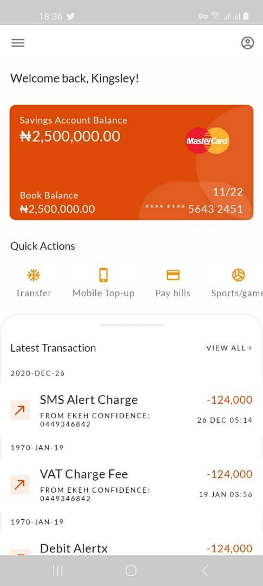
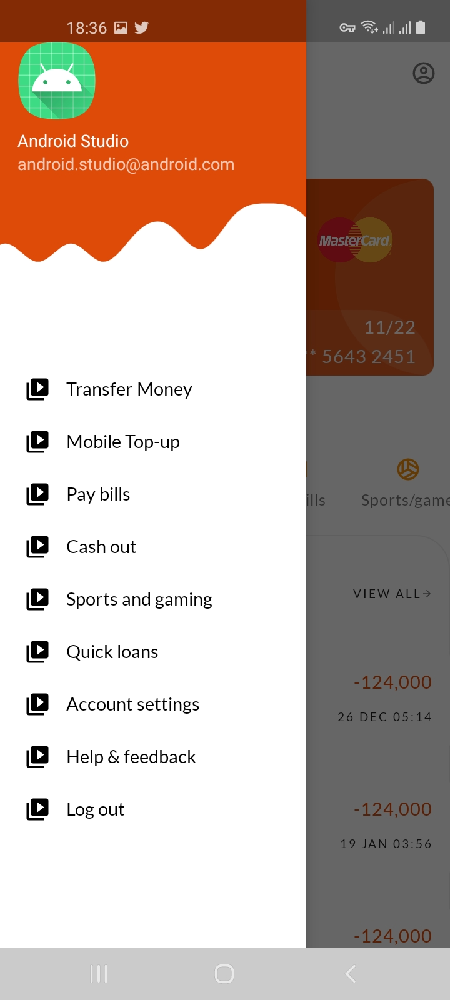
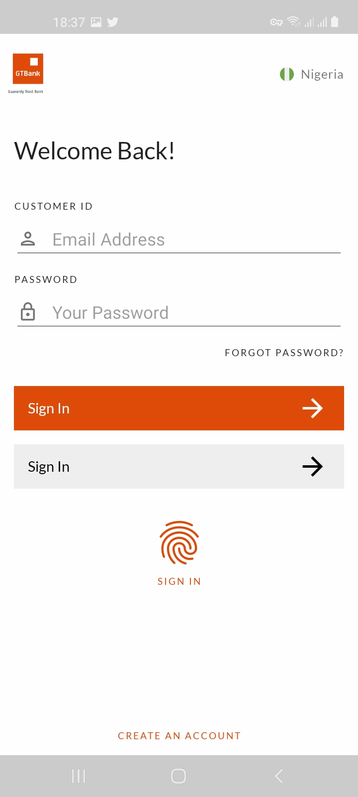

# GTB PROPOSED UI

    

This app literally does nothing meaningful. It's just an actual implementation of the figma design made by Esther.

##### UI credit goes to: [Atasie Esther](https://tassyomah.medium.com/a-visually-better-and-user-centered-redesign-of-gtbank-mobile-app-ui-ux-case-study-c6dce61f688d)

 Please note that this app is still in progress and a lot is still yet to be done!

 ##### The app is in no way connected to any brand. This is only for learning purposes.

## Features

* Kotlin Coroutines with Flow and Livedata
* Model View View-Model (MVVM) Architecture
* Jetpack Navigation
* Offline Usage
* Dagger Hilt
* Day and Night Mode(Still in progress. Dark mode sucks right now )
* Paging Library
* Transitions(Still in progress)

## Libraries

* [Data Binding](https://developer.android.com/topic/libraries/data-binding)
* [Dagger Hilt](https://dagger.dev/hilt)
* [Room Database](https://developer.android.com/training/data-storage/room)
* [Kotlin Coroutines](https://github.com/Kotlin/kotlinx.coroutines)
* [ViewModel](https://developer.android.com/topic/libraries/architecture/viewmodel)
* [Paging library 3](https://developer.android.com/topic/libraries/architecture/paging/v3-overview)

<h2 align="left">Screenshots</h2>
<h4 align="center">

 

##### App Design is inspired by [Atasie Esther](https://tassyomah.medium.com/a-visually-better-and-user-centered-redesign-of-gtbank-mobile-app-ui-ux-case-study-c6dce61f688d)

## Author
Etoka Kingsley
